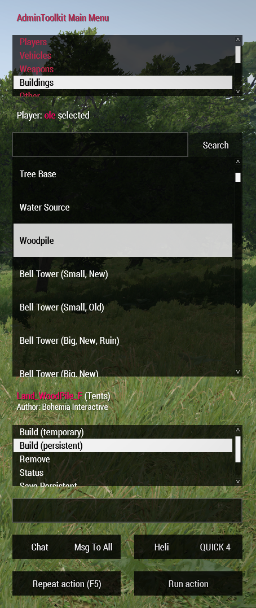
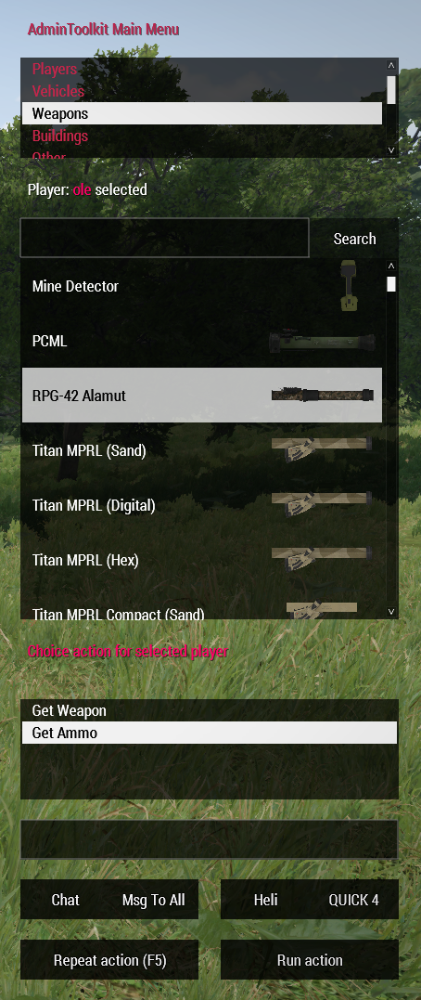

## AdminToolkit for Arma 3
<sup>**Version 2.0.2** | Author: ole1986 | This work is licensed under a Creative Commons Attribution-NonCommercial 4.0 International License</sup>

This tool is used to administrate Arma3 multiplayer servers. 
It also supports an option to overwrite the sections for additional features. 

**<p align="center"><a href="#installation">Installation</a> <a href="#extending-the-admintoolkit">Extensions</a></p>**

**<p align="center">PRESS THE F2 KEY TO OPEN IN-GAME</p>**






<p align="center">Video<br/>
    <a href="https://youtu.be/2yfdqvhU5A0" target="_blank"></a>
</p>

## Core Features

**Players**
- Setup administrators or moderators with limited access
- Teleport from/to players and to map position (by using the in-game map - hold ALT key and press LMB)
- Spectate player using WASD plus Q and E keys  <sup>improved since version 1.6</sup>
- God Mode
- Kick/Ban players
- Global chat messages

**Vehicles**
- Vehicle spawn for yourself or a selected player
- (Exile Addon) Spawn persistent vehicles with PIN CODE

**Weapons**
- add weapon to inventory
- add ammo to inventory

**Construction & Others**
- Building persistence supported (since v1.4)
- Place buildings by using **Q, E for rotation**, **PAGEUP/PAGEDOWN and HOME/END for moving** the constructions
- spawn additional "vehicle items" like Backpacks, GPS, Binocular, etc... (located in Other)

**Extension support**
- allows you to extend and overwrite features with your own extension file(s)

## Installation

### Required Tools

+ PBO Manager - to setup UIDs and server password in server pbo
+ Notepad++ or any other Text Editor (https://notepad-plus-plus.org/)

### Client (**only for Admin/Moderator only**)

+ Copy the folder `@AdminToolkit` into your Arma 3 game directory (E.g. `C:\Steam\steamapps\common\Arma 3`) 
+ Load the mod through Arma 3 Launcher when you run the game

### Server (**UPDATED**)

+ Copy the @AdminToolkitServer folder into your servers root directory
+ Unpack the @AdminToolkitServer\addons\admintoolkit_servercfg.pbo and customize the containing config.cpp accordingly - see <a href="#configuration">Configuration</a>
+ Pack the folder @AdminToolkitServer\addons\admintoolkit_servercfg into admintoolkit_servercfg.pbo and overwrite 
+ Copy the `admintoolkit.bikey` server key file into the `keys` folder of your servers root directory
+ **Enable the AdminToolkit using -servermod=@AdminToolkitServer**

### MissionFile

+ Open the `description.ext` and add the below line into `class CfgRemoteExec -> class Functions`

```
class AdminToolkit_network_receiveRequest { allowedTargets = 2; };
```

For extension related implementations, please follow the <a href="#extensions">extension instructions below</a>

## Configuration

Before you can use the AdminToolkit it is necessary to **add you as administrator**.
Please find the server `config.cpp` in your `@ExileServer\admintoolkit_server` directory and amend it according to your requirements

```
/**
 * Server command password required to execute kick, ban, etc...
 */
ServerCommandPassword = "";
/**
 * list of allowed admins using its player UID
 */
AdminList[] = {"yourPlayerUIDHere"};
/**
 * list of admins with restricted access only
 */
ModeratorList[] = {""};
```

Moderators can have restricted access - help yourself and read the config.cpp carefully to customize the permissions

## Extensions

The AdminToolkit can be extended by using the MissionFile configuration class `CfgAdminToolkitCustomMod`.
For more details, please refer to the <a href="%40MissionFile/README.md">@MissionFile/README.md</a>

**Below is a list of available extensions**

| Name       | Description                                                                  | Autor(s)  | Links                                           
| ---------- | ---------------------------------------------------------------------------- | --------- | --- 
| ExileMod   | create persistent vehicles, receive ExileMoney and build objects, etc...     | ole       | <a href="@MissionFile/README.ExileMod.md">README</a>
| Furniture  | support to build Furniture objects (Menu "Stoll Furniture")                  | Stoll     | <a href="@MissionFile/README.Furniture.md">README</a>
| VanillaAI  | Experimental extension to support spawning AI units                          | ole       | <a href="@MissionFile/README.VanillaAI.md">README</a>

## Battleye

Please use the below **Battleye Script Filters tool** to setup all Battleye exceptions:

http://a3ap.com/BEF.php
