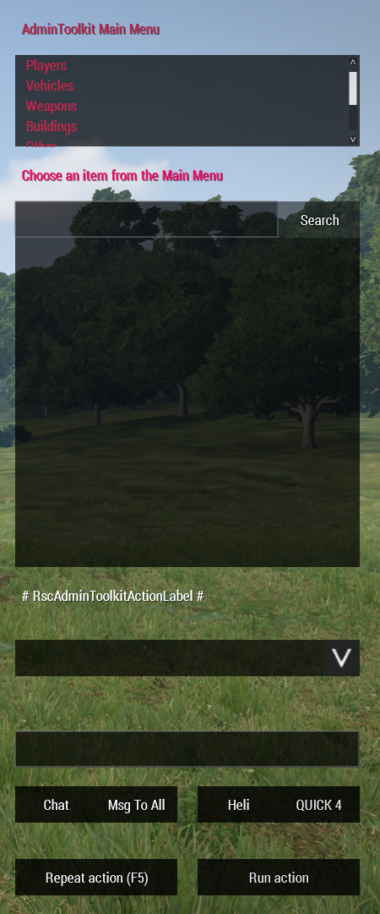
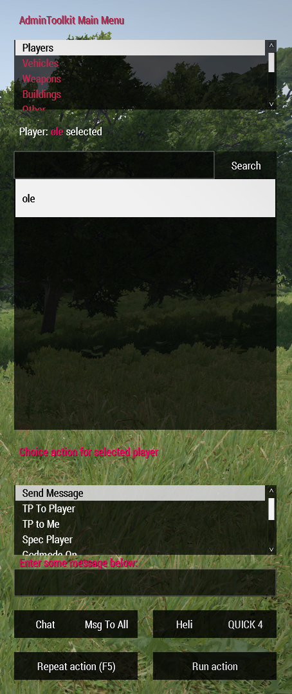
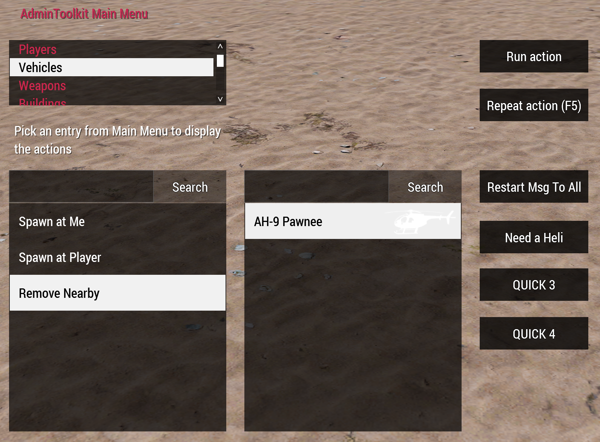

## AdminToolkit for Arma 3
<sup>**Version 2.0** | Author: ole1986 | This work is licensed under a Creative Commons Attribution-NonCommercial 4.0 International License</sup>

This tool is used to administrate Arma3 multiplayer servers. 
It also supports an option to overwrite the sections for additional features. 

**Also, check out the <a href="#extensions">Extensions</a> avaiable for AdminToolkit**

**<p align="center">PRESS THE F2 KEY TO OPEN IN-GAME</p>**





<p align="center">
Video<br/>
<a href="https://www.youtube.com/watch?v=Hznh7DSM38E" target="_blank"></a>
</p>
**Core Features:**

**Players**
- Setup administrators or moderators with limited access
- Teleport from/to players and to map position (by using the in-game map - hold ALT key and press LMB)
- Spectate player
- God Mode
- Kick/Ban players

**Vehicles**
- Vehicle spawn for yourself or a selected player
- (Exile Addon) Spawn persistent vehicles with PIN CODE

**Weapons**
- add weapon to inventory
- add ammo to inventory

**Construction & Others**
- NEW: Building persistence supported (since v1.4)
- Place buildings by using **Q, E for rotation**, **PAGEUP/PAGEDOWN and HOME/END for moving** the constructions
- spawn additional "vehicle items" like Backpacks, GPS, Binocular, etc... (located in Other)

## Installation

### Required Tools

+ PBO Manager - to setup UIDs and server password in server pbo
+ Notepad++ or any other Text Editor (https://notepad-plus-plus.org/)

### Client

+ Copy the folder `@AdminToolkit` into your Arma 3 game directory (E.g. `C:\Steam\steamapps\common\Arma 3`) 
+ Load the mod through Arma 3 Launcher when you run the game

### MissionFile (**since v1.56.134627 - Eden Update**)

+ Open the `description.ext` and add the below line into `class CfgRemoteExec -> class Functions`

```
class AdminToolkit_network_receiveRequest { allowedTargets = 2; };
```

### Server

+ Open the `@ExileServer\admintoolkit_server` folder and setup the `config.cpp` accordingly - see <a href="#configuration">Configuration</a>
+ Pack the `@ExileServer\admintoolkit_server` folder (containing your config.cpp changes) into `admintoolkit_server.pbo`
+ Copy the `@ExileServer\admintoolkit_server.pbo` into your `@ExileServer\addons` directory from the server.
+ Copy the `admintoolkit.bikey` server key file into your server `keys` directory

## Configuration

Before you can use the AdminToolkit it is necessary to add you as administrator.
Please find the server `config.cpp` in your `@ExileServer\admintoolkit_server` directory and amend it according to your requirements

```
/**
 * Server command password required to execute kick, ban, etc...
 */
ServerCommandPassword = "";
/**
 * list of allowed admins using its player UID
 */
AdminList[] = {"76561198088277918"};
/**
 * list of admins with restricted access only
 */
ModeratorList[] = {""};
/**
 * allowed commands for moderators (default: teleport to a player, get a vehicle, get player list, spectate)
 */
ModeratorCmds[] = {"login","getplayers","tp2player", "getvehicle", "kickplayer", "specplayer", "specstop"};
```

Moderators have limited access - The command list can optionally be customized

## Extensions

The AdminToolkit can be extended with your addon features by using the MissionFile configuration class `CfgAdminToolkitCustomMod`.
More details can be found in the <a href="%40MissionFile/README.md">@MissionFile/README.md</a>

**List of available extensions**

| Name       | Description                                                      | Link
| ---------- | ---------------------------------------------------------------- | ----
| ExileMod   | create persistent vehicles, receive ExileMoney and build objects | <a href="@MissionFile/README.exile.md">Installation</a>
| Furnitures | Example extension on how to overwrite Buildings section with only furnitures | <a href="@MissionFile/README.furniture.md">Installation</a>

### Battleye

Highly recommended to use the following Battleye Filter tool to fix all BE exceptions:

http://gp.gamersinc.net/BEF.php

**remoteexec.txt**

+ add `!"AdminToolkit_network_receiveRequest"` to the end of the line

**scripts.txt**

+ add `!="displayAddEventHandler [\"KeyDown\",\"call AdminToolkit_bindEvents;\"]"` at the end of `7 eventHandler [...]`
+ add `!="remoteExecCall ['AdminToolkit_network_receiveRequest',"` at the end of `7 remoteexec`
+ add `7 onMapSingleClick !="call admintoolkit_butt"` as a new line if `7 onMapSingleClick` does not exists or add it to the end of the line
+ add `!="\nAdminToolkit_camera = \"camera\" camCreate"` at the end of line `7 camCreate`
