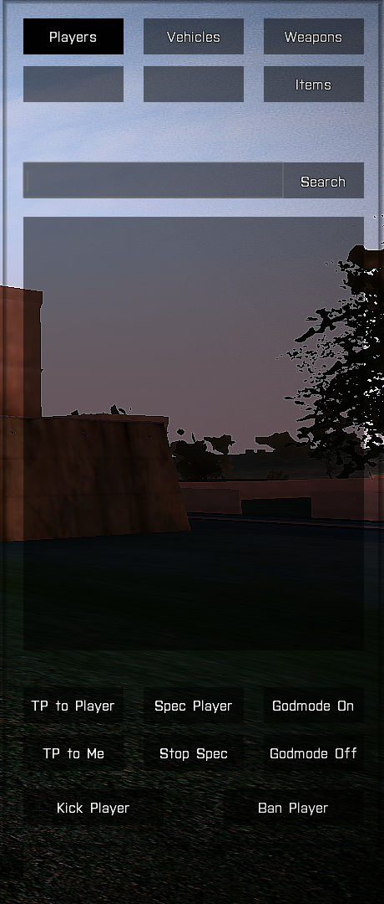
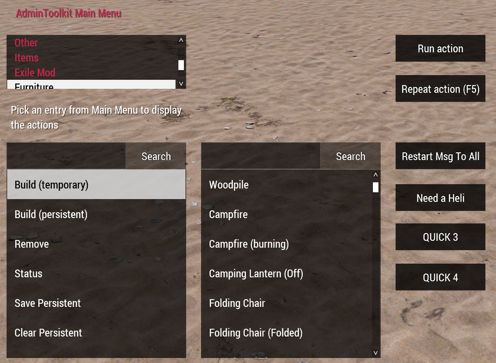
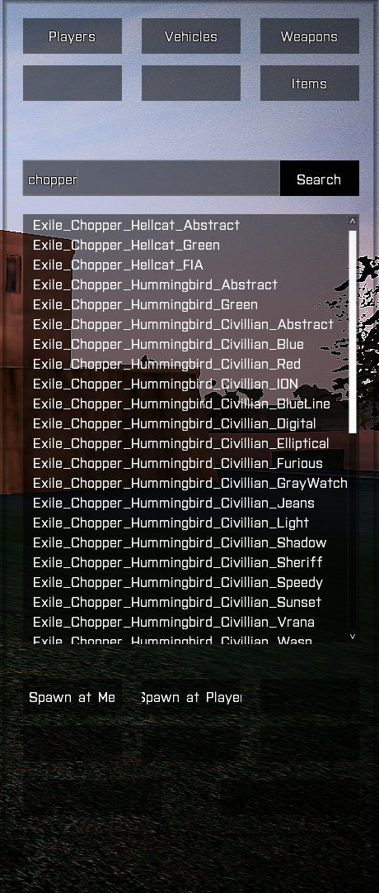
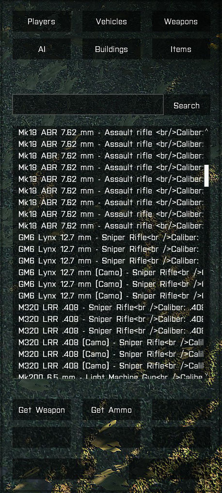
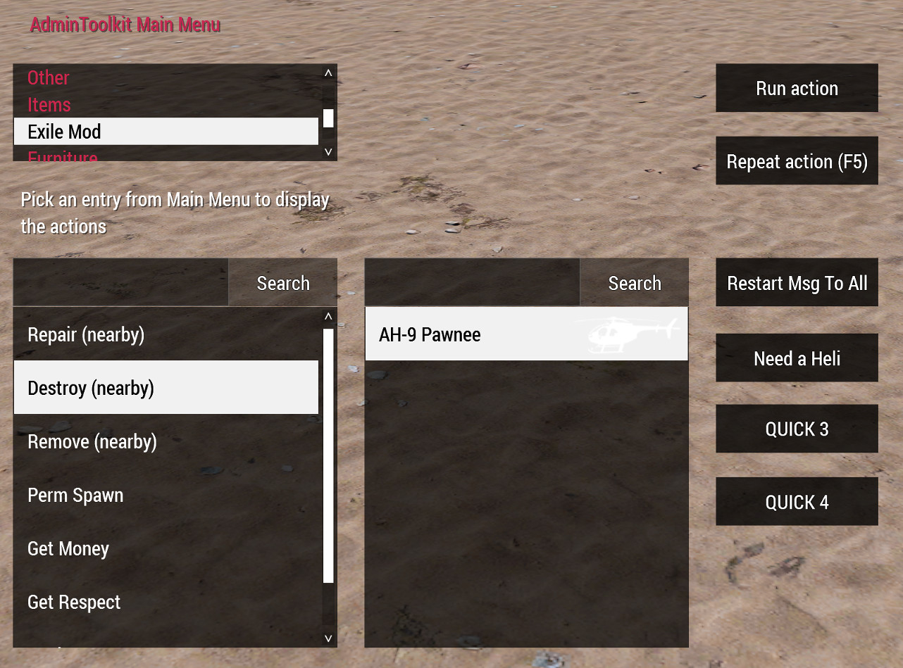
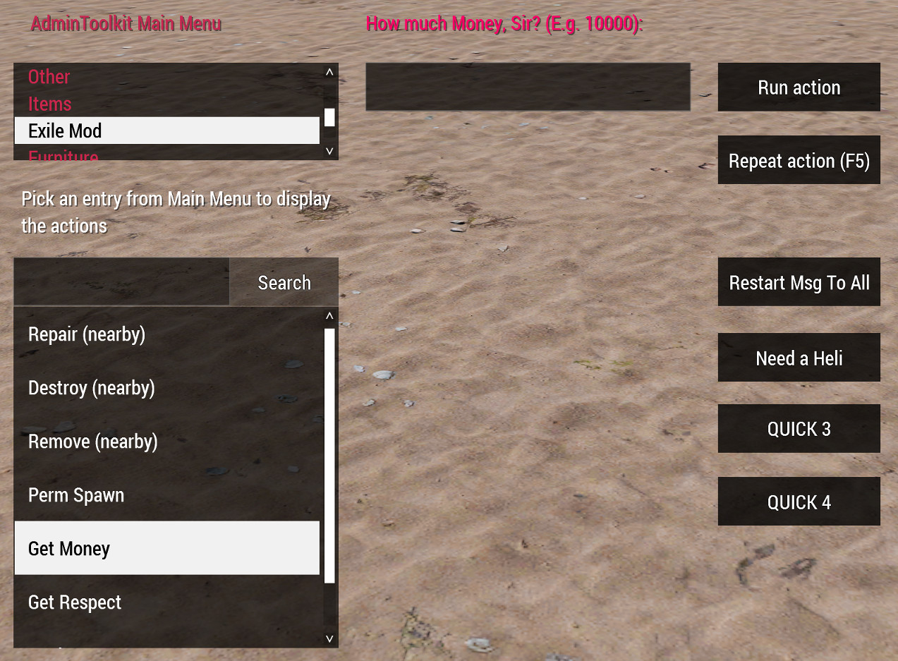

## AdminToolkit for Arma 3
[](https://github.com/ole1986/a3-admintoolkit/releases)
[](https://github.com/ole1986)
[](http://www.exilemod.com/devblog/103-update-lemon-r34/)
[](https://dev.arma3.com/post/sitrep-00203)
[](https://www.bistudio.com/community/licenses/arma-public-license)

The ATK is used to administrate Arma 3 multiplayer servers and be extended with user extensions








**Videos**

<a href="https://www.youtube.com/watch?v=pMwK2d-1Fqg" target="_blank"></a>
<a href="https://youtu.be/2yfdqvhU5A0" target="_blank"></a>

## Features

For a complete list of all features, please refer to <a href="FEATURES.md">FEATURES.md</a>

## Requirements

* [Arma 3 Tools](https://community.bistudio.com/wiki/Arma_3_Tools_Installation) through Steam
* [Visual Studio Code](https://code.visualstudio.com/download)
* [Arma-Dev extension](https://marketplace.visualstudio.com/items?itemName=ole1986.arma-dev) for Visual Studio Code

## Installation

Before you start, please download and install the software mentioned in the <a href="#requirements">Requirements</a> section.

* Download and extract a3-admintoolkit
* Open the folder `a3-admintoolkit-master` with Visual Studio code (vscode)
* Add your player UID into the `source\admintoolkit_servercfg\config.cpp`, see <a href="#configuration">Configuration</a>
* Press `F1` in vscode and run the command `Arma 3: Pack` to build all pbo files
* Use `.\setup.ps1 -PatchMission` to patch your favorite mission file, see <a href="#mission-file">Mission File</a>
* Copy all pbo files to the client and server, see <a href="#copy-files">Copy Files</a>

### Configuration

The AdminToolkit uses a server configuration file (config.cpp) to add administrators and moderators.<br />
So, open the file `source\admintoolkit_servercfg\config.cpp` and add your player uid into `AdminList[]`

Example:

```
AdminList[] = {"yourPlayerUID"};
```

Optionally you can add the ServerCommandPassword (stored in the config.cfg of your server) to manage kick and bans from the AdminToolkit

```
ServerCommandPassword = "yoursecretpassword";
```

As the AdminToolkit has a moderator mode, those player uids go to

```
ModeratorList[] = {"playerUID"};
```

Moderators can have restricted access - Please help yourself and read the config.cpp carefully to customize the permissions

### Mission File

This project is shipped with a mission file patcher. 
Use the command below to patch you favorite mission file.

```
PS> .\setup.ps1 -PatchMission
```

A dialog prompt will appear and let you choice your Mission.File.pbo. Output is stored in the folder `@MissionFile\<Your.Mission.pbo>`

### Copy Files

PLEASE MAKE SURE YOU HAVE FOLLOWED ALL INSTALLATION STEPS BEFORE YOU COPY ALL FILES

**Client**

Copy the folder `@AdminToolkit` into your Arma 3 game directory.<br />
Enable the mod through the Arma 3 Launcher or with startup parameters.

**Server**

* Copy the `@AdminToolkitServer` folder into your servers game root directory
* Copy the **patched mission file** located in `@MissionFile` into your servers `mpmissions` directory
* Copy the `admintoolkit.bikey` into your servers `keys` folder
* Enable the AdminToolkit mod on the server by running the arma3server with parameter `-servermod=@AdminToolkitServer`

## Extensions

The AdminToolkit can be extended by using the MissionFile configuration class `CfgAdminToolkitCustomMod`.
For more details, please refer to the <a href="README.MissionFile.md">/README.MissionFile.md</a>

**Below is a list of available extensions**

| Name       | Description                                                                  | Autor(s)  | Links                                           
| ---------- | ---------------------------------------------------------------------------- | --------- | --- 
| ExileMod   | create persistent vehicles, receive ExileMoney and build objects, etc...     | ole       | <a href="source/mission_file/atk/README.ExileMod.md">README</a>
| Furniture  | support to build Furniture objects (Menu "Stoll Furniture")                  | Stoll     | <a href="source/mission_file/atk/README.Furniture.md">README</a>
| VanillaAI  | Experimental extension to support spawning AI units                          | ole       | <a href="source/mission_file/atk/README.VanillaAI.md">README</a>

## Battleye

Please use the below **Battleye Script Filters tool** to setup all Battleye exceptions:

http://a3ap.com/BEF.php
