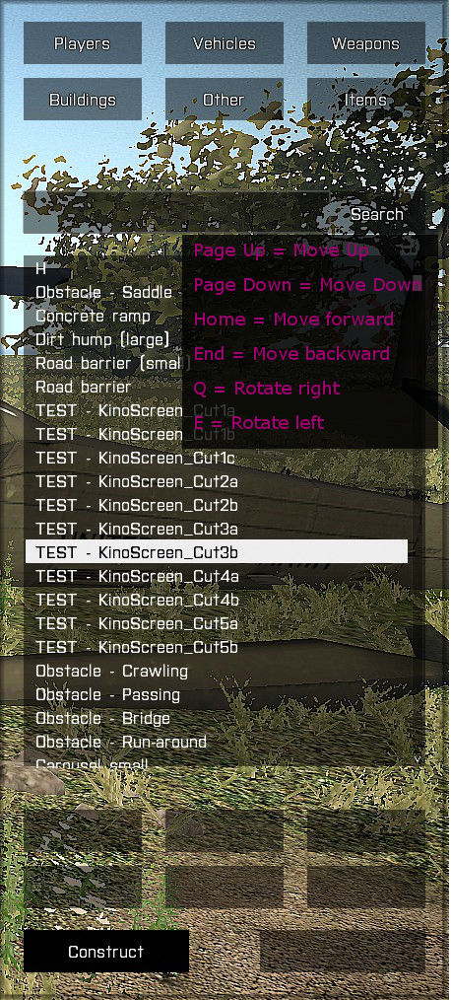

## AdminToolkit for Arma 3 v0.9

A tool used to administrate Arma3 multiplayer server.

<sup>*This work is licensed under a Creative Commons Attribution-NonCommercial 4.0 International License.*</sup>

**<p align="center">PRESS THE F2 KEY IN-GAME TO OPEN</p>**




<p align="center">
Video<br/>
<a href="https://www.youtube.com/watch?v=Hznh7DSM38E" target="_blank"></a>
</p>
**Core Features:**

**Players**
- Teleport from/to players and to map position (by using the in-game map - hold ALT key and press LMB)
- Spectate player
- God Mode
- Kick/Ban players

**Vehicles**
- Vehicle spawn for yourself or a selected player
- (Exile Addon) Spawn persistent vehicles with PIN CODE

**Weapons**
- add weapon to inventory
- add ammon to inventory

**Construction & Others**
- Place buildings by using **Q, E for rotation**, **PAGEUP/PAGEDOWN and HOME/END for moving** the constructions
- spawn additional "vehicle items" like Backpacks, GPS, Binocular, etc... (located in Other)

*Please note: This does not replace an AntiCheat software (like battleye)*

## Installation
### Required Tools

+ PBO Manager - to setup UIDs and server password in server pbo
+ Notepad++ or any other Text Editor (https://notepad-plus-plus.org/)

### Client

+ Copy the directory `@AdminToolkit` folder into your Arma3 game directory 
+ Load the mod through Arma 3 Launcher when you start the game

### MissionFile (**v1.56.134627 - Eden Update**)

+ Open the description.ext and add the below line inside `class CfgRemoteExec -> class Functions`

```
class AdminToolkit_network_receiveRequest { allowedTargets = 2; };
```

### Server

+ Copy the `admintoolkit.pbo` from the @ExileServer folder into your `<ExileServerMod>\addons` directory.
+ Setup the `config.cpp` accordingly - see <a href="#configuration">Configuration</a>
+ Copy the `admintoolkit.bikey` server key file into your server `keys` directory
 
### Addons

EXILE: <a href="@MissionFile/README.exile.md">AdminToolkit with ExileMod features</a>

## Configuration

Before you can use the AdminToolkit it is necessary to add you as administrator.
Please find the server `config.cpp` in your `@ExileServer\admintoolkit` directory and amend it according to your requirements

```
/**
 * Server command password required to execute kick, ban, etc...
 */
ServerCommandPassword = "";
/**
 * list of allowed admins using its player UID
 */
AdminList[] = {"76561198088277918"};
/**
 * list of admins with restricted access only
 */
ModeratorList[] = {"76561198037325738"};
/**
 * allowed commands for moderators (default: teleport to a player, get a vehicle, get player list, spectate)
 */
ModeratorCmds[] = {"tp2player", "getvehicle", "kickplayer", "playersCallback", "specplayer", "specstop"};
```

Moderators have limited access - The command list can optionally be customized

### Battleye

**remoteexec.txt**

+ add `!"AdminToolkit_network_receiveRequest"` to the end of the line

**scripts.txt**

+ add `!="displayAddEventHandler [\"KeyDown\",\"call AdminToolkit_bindEvents;\"]"` at the end of `7 eventHandler [...]`
+ add `!="remoteExecCall ['AdminToolkit_network_receiveRequest',"` at the end of `7 remoteexec`
+ add `7 onMapSingleClick !="call admintoolkit_butt"` as a new line if `7 onMapSingleClick` does not exists or add it to the end of the line
+ add `!="objectFromNetId _params;\nadmintoolkit_specCam = \"camera\" camCreate"` at the end of line `7 camCreate`
